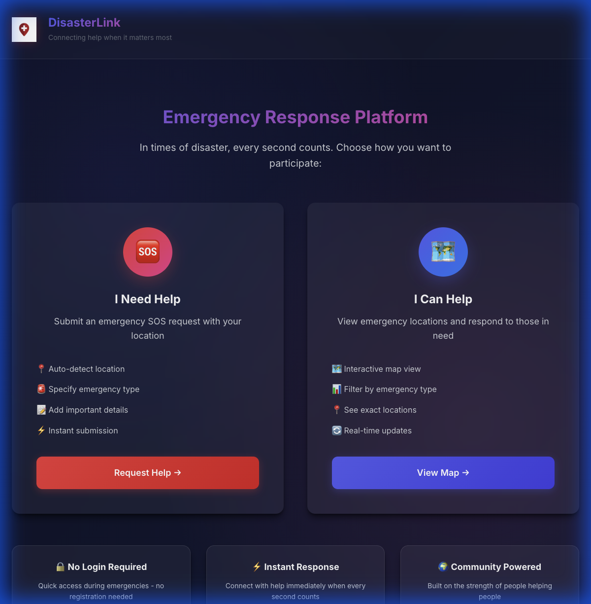
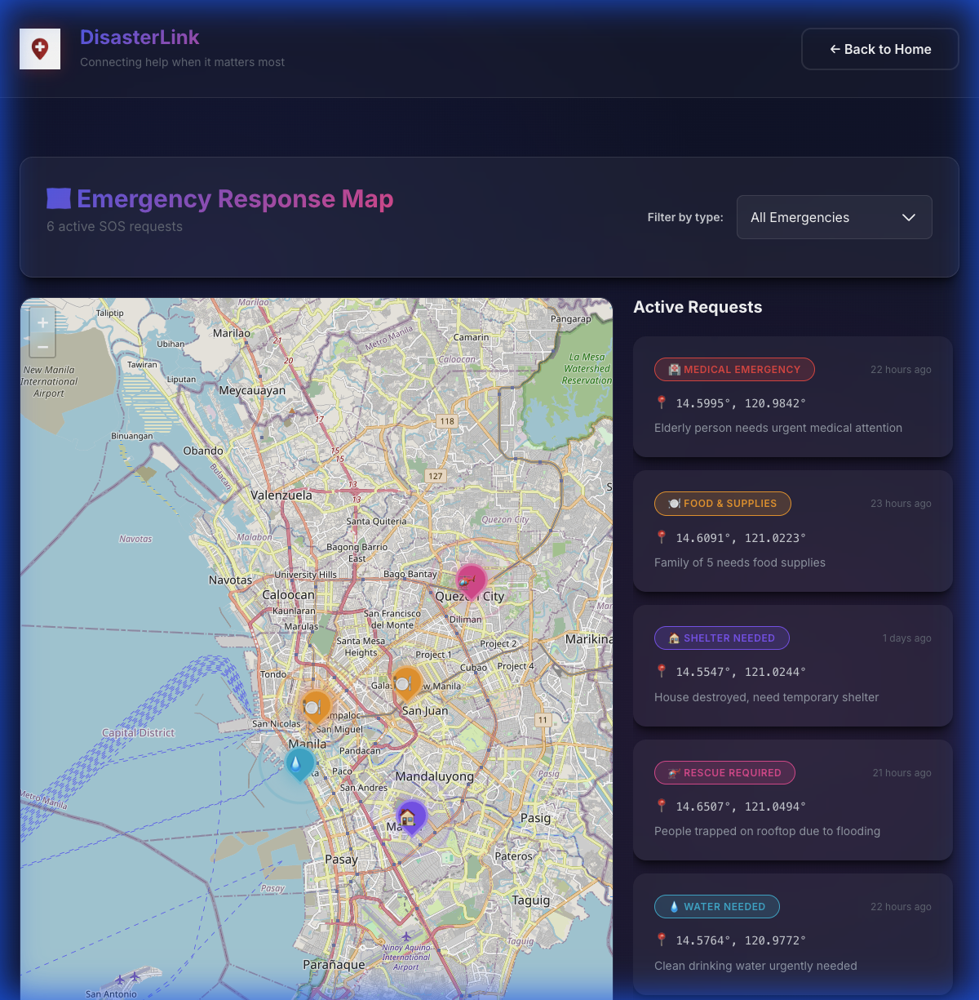

# Rescue Radar - Emergency Response Platform 🆘

**Rescue Radar** is a community-driven emergency response platform designed to connect people in need with those who can help during natural disasters. It features a simple SOS submission form and an interactive map for responders.

## 📸 Screenshots





## 🌍 Mission & Call for Hosting

**This project is built to help the public.** In times of crisis, communication is key. We have built this open-source solution to provide a rapid deployment tool for disaster relief.

**We are looking for organizations or individuals to host this platform permanently.** If you have the resources to deploy and maintain this for the public good, please do so!

## ⚠️ License & Usage Restrictions

**NON-COMMERCIAL USE ONLY**

This code is provided freely for **humanitarian and non-profit use only**.
*   ❌ You are **NOT** allowed to use this code for any business, commercial, or for-profit purposes.
*   ❌ You are **NOT** allowed to sell this software or charge for its use.
*   ✅ You **ARE** encouraged to use this for NGOs, government relief efforts, and community aid groups.

## 🚀 Setup Instructions

### Prerequisites
*   Node.js (v18+)
*   AWS CLI & SAM CLI (for backend)

### 1. Frontend Setup
The frontend is built with React and Vite.

```bash
# Install dependencies
npm install

# Start development server
npm run dev
```

### 2. Backend Setup (AWS Serverless)
The backend uses AWS API Gateway, Lambda, and DynamoDB.

1.  Navigate to the backend directory:
    ```bash
    cd backend
    ```
2.  Follow the [Backend Deployment Guide](./backend/README.md) to deploy to AWS.
3.  After deployment, copy your API Endpoint URL.
4.  Create a `.env` file in the root directory and add your API URL:
    ```
    VITE_API_URL=https://your-api-id.execute-api.us-east-1.amazonaws.com
    ```

## 🛠️ Technology Stack

*   **Frontend**: React, Vite, Leaflet (OpenStreetMap)
*   **Backend**: AWS Serverless (API Gateway, Lambda, DynamoDB)
*   **Security**: AWS WAF (Web Application Firewall)

## 🙌 Credits & Acknowledgements

This project was made possible by the following technologies and tools:

*   **Google DeepMind / Gemini**: For the AI assistance in coding and architecture design.
*   **AWS**: For providing the robust serverless infrastructure (Lambda, DynamoDB, API Gateway).
*   **React**: For the powerful UI library.
*   **OpenStreetMap & Leaflet**: For the open-source mapping solutions.
*   **Vite**: For the fast build tooling.

---
*Built with ❤️ for humanity.*
